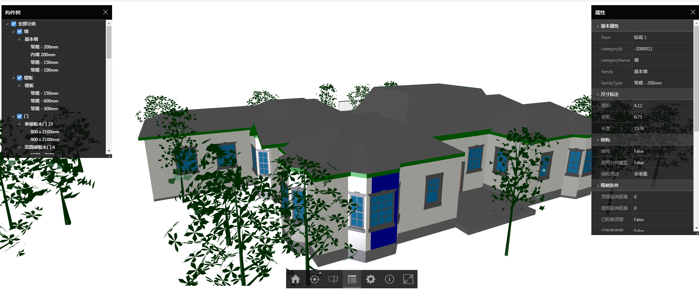

# BIMFACE Javascript SDK 升级快速指南
## 简介
本指南用于指导原BIMFACE Javascript SDK用户进行SDK升级。

## 基本概念
- **模块化** BIMFACE新SDK将功能拆分为不同的模块, 方便用户根据不同的应用场景进行调用。
    - Glodon.Bimface.Viewer           包含模型显示相关功能。如模型渲染, 模型操作。
    - Glodon.Bimface.Data             包含数据属性获取等功能。如构件属性获取。
    - Glodon.Bimface.Authentication   包含验证功能。
    - Glodon.Bimface.UI               包含UI控件。如按钮，工具条。
    - Glodon.Bimface.Application      包含Bimface应用程序。如WebApplication含有UI， 模型浏览等功能。
- **原生UI** 新SDK将提供常用UI创建功能。 
- **原生数据获取** 新SDK将提供数据数据查询和获取功能。
- **原生插件** 新SDK将提供插件功能， 比如
    - 标签 （在建中）    
    - 小地图 （在建中）
    - 批注 (将会提供)

## 升级指南 (3D)
### 一般用户升级

对于原有SDK轻度用户来说, 通过以下步骤就能得到一个可工作的BIMFACE应用程序。
1. 复制[BimfaceSDKSample_Application](https://github.com/bimface/js-sdk/blob/master/sample/BimfaceSDKSample_WebApplication2D.html)中的示例。
2. 将示例源代码替换你原有的代码。
3. 修改代码中的viewToken。

升级完成后的界面如下。其中包括工具条, 构件树和属性面板等新功能。

### 高级用户升级
对于深度使用原有SDK，并且定制了自己产品的用户, 
1. 参考[BimfaceSDKSample_Properties](https://github.com/bimface/js-sdk/blob/master/sample/BimfaceSDKSample_GetProperties2D.html)可用看到新版SDK对Authentication, Viewer及属性获取的基本应用。
2. 修改BimfaceSDKLoaderConfig， 引用Debug版本的SDK, 方便调试。  
`bimfaceLoaderConfig.configuration = BimfaceConfigrationOption.Debug;`
3. 在浏览器调试台中的源代码面板可找到BimfaceSDK的Debug代码。
4. 由于老版本SDK只提供viewer功能， 所以用户需要参考新老功能函数对照表来修改代码。

#### 新老功能函数对照表

|Function|Previous Style|New Style|Comment|
|:--|:--|:--|:--|
|Rendering|Viewer.render()|Viewer.render()||
|Enable rotation|Viewer.disableRotation(enable)|Viewer.enableOrbit(isEnabled)|Valid values are true and false. Defaut is true.|
|Limit frame rate|Viewer.limitFrameRate()|Viewer.setMinimumFPS(num)|The minimal value should be 4.|
|Go to home view|Viewer.home()|Viewer.setView(ViewOption.Home)|ViewOption could be values supported by cloud viewer.|
|Show all components|Viewer.showAll()|Viewer.showAllComponents()||
|Get camera|Viewer.getCamera()|Viewer.getCameraStatus()|The camera status is an object, instead of a string.|
|Set camera|Viewer.setCamera()|Viewer.setCameraStatus(status)||
|Zoom to selection of components|Viewer.zoomToSelection|Viewr.zoomToSelectedComponents()||
|Zoom to bounding box|Viewer.zoomToBox()|Viewer.zoomToBoundingBox(bbox)|bbox should be an object with Point3D members.|
|Set active tool|Viewer.setRotationMode('normal')|Viewer.setNavigationMode(NavigationMode.Select)|1. For 3D only .|
||||2. NavigationMode values are Select, Fly, Zoom and Orbit.|
|Set orbit button|Viewer.setOrbitButton(mode)|Viewer.setOrbitButton(OrbitButton.Left)|1. Default to use left button to orbit.|
||||2. OrbitButton options are Left and Right.|
|Full screen|Viewer.fullScreen()|Viewer.enableFullScreen(true)|1. Valid values are true and false.|
|Isolate components|Viewer.action.isolate([ids], ‘translucent’)|Viewer.isolateComponentsById([ids], IsolationOption.MakeOthersTranslucent)|IsolationOption values are MakeOthersTranslucent and HideOthers. Default is MakeOthersTranslucent.|
|Isolate components with conditions|Viewer.isolate([conditions], ‘hide’)|Viewer.isolateComponentsByObjectData([conditions], IsolationOption.HideOthers)|IsolationOption values are MakeOthersTranslucent and HideOthers. Default is MakeOthersTranslucent.|
|Unisolate components|Viewer.unIsolate()|Viewer.clearIsolation()||
|Set visible conditions|Viewer.setVisibleConditions()|remove from 2.0||
|Highlight components|Viewer.action.highlight([ids], ‘blue’)|Viewer.hightComponent([ids], ColorOption.Blue, name)|1. ColorOption values are Blue, Red, Yellow, Green and rainbow colors.|
||||2. Pass a color object. Color should be an object with red, green, blue, alpha members.|
|Load scene|Viewer.load()|Viewer.addView||
|Unload scene|Viewer.unload()|Viewer.removeView|TBD Haizhen and Samuel to clarify.|
|Show scene|Viewer.showScene()|Viewer.showView()||
|Hide scene|Viewer.hideScene()|Viewer.hideView()||
|Resize view|Viewer.resize()|Viewer.resize()||
|Set background color|Viewer.setBackgroundColor|Viewer.setBackgroundColor(color)|Color should be an object or ColorOption.|
|Get selected components|Viewer.getSelection()|Viewer.getSelectedComponents()||
|Add components to selection|Viewer.action.setSelection|Viewer.setSelectedComponentsById(ids)||
|||Viewer.addSelectedComponentsById(ids)||
|Get current state|Viewer.getState()|Viewer.getCurrentState()||
|Set state|Viewer.setState()|Viewer.setState()||
|Get screenshot|Viewer.getImage()|Viewer.createSnapshot()||
|Initialize viewer|var b = new bimFace()|var viewer3D = new Glodon.Bimface.Viewer.Viewer3D();|config is an object.|
||b.init()|viewer3D.initialize(config)||
|Add Event Binding|Viewer.on(‘eventName’, cb)|Viewer.addEventListener(ViewerEvent, cb)|ViewerEvent is enum and the values are TBD|
|Remove Event Binding|Viewer.off(‘eventName’, cb)|Viewer.removeEventListener(ViewerEvent, cb)|ViewerEvent is enum and the values are TBD|
|Show components|Viewer.action.show()|Viewer.showComponents||
|Hide components|Viewer.action.hide()|Viewer.hideComponents()||
|Make components transparent|Viewer.action.translucent()|Viewer.setComponentsOpacity([ids],  OpacityOption.Translucent)||
|Make components opaque|Viewer.action.untranslucent()|Viewer.setComponentsOpacity([ids], OpacityOption.Opaque)||
|Get family list|Viewer.getFamilyList()|Viewer.getFamilyTypes()|For RfaView only.|
|Show family type|Viewer.showType()|Viewer.showFamilyTypeById(id)|For RfaView only|

